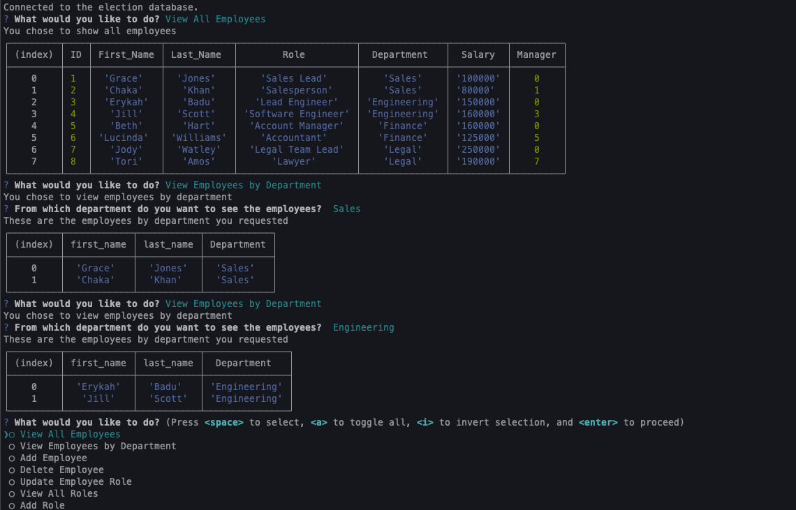

# Employee-Tracker

### User Story
As a user, I require a command-line programme that will track my business's personnel. I want to be able to view my departments, my personnel, and their roles by responding to command prompt inquiries. I want to be able to delete departments and create new ones as a user. As a user, I would also appreciate the capacity to modify a worker's role. I want to be able to add and remove employees as a user. I should be asked to submit the employee's name, department, and job when I request to add an employee. the name, ID, role, department, and salary of each person when I view them should then be returned..
### Features
This app features a command line interface that interacts with the user.
This app will prompt the user with a menu to :
View all employees
Add an Employee
Delete an Employee
Update Employee Role
View All Roles
Add a Role
View All departments
Add a Department
Delete a Department
When a user inputs the requested data the appropriate CRUD(Create, Read, Update or Delete) action is applied to the databse.

### badges

## Table of Contents

- [installation](#installation)
- [contribution guidelines](#contribution)
- [Test Instructions](#testing)
- [License](#license)
- [Questions](#questions)

### Installation
1. Please clone the github repo here :
https://github.com/NebiatHNana/employee-tracker
2. Run npm install to install the dependecies.
3. Then at the root folder, run npm start 
4. and go to: http://localhost:3000/#home
5. Test the app by going through the menu to Create, Update, Read or Delete Data

### Contribution Guidelines
Current contributers:
Kevin Reid : https://github.com/NebiatHNana 

### Testing
1. Please clone the github repo here :
https://github.com/NebiatHNana/employee-tracker
2. Run npm install to install the dependecies.
3. Then at the root folder, run npm start 
4. and go to: http://localhost:3000/#home
5. Test the app by going through the menu to Create, Update, Read or Delete Data

### Questions
    email address : nebiat.nana@mail.utoronto.ca

### Image of example readme.md

### 
link to video on how this app works :

https://drive.google.com/file/d/1_iNPwGPmyZ_OKM3qExMj112IBZDaSKNT/view
